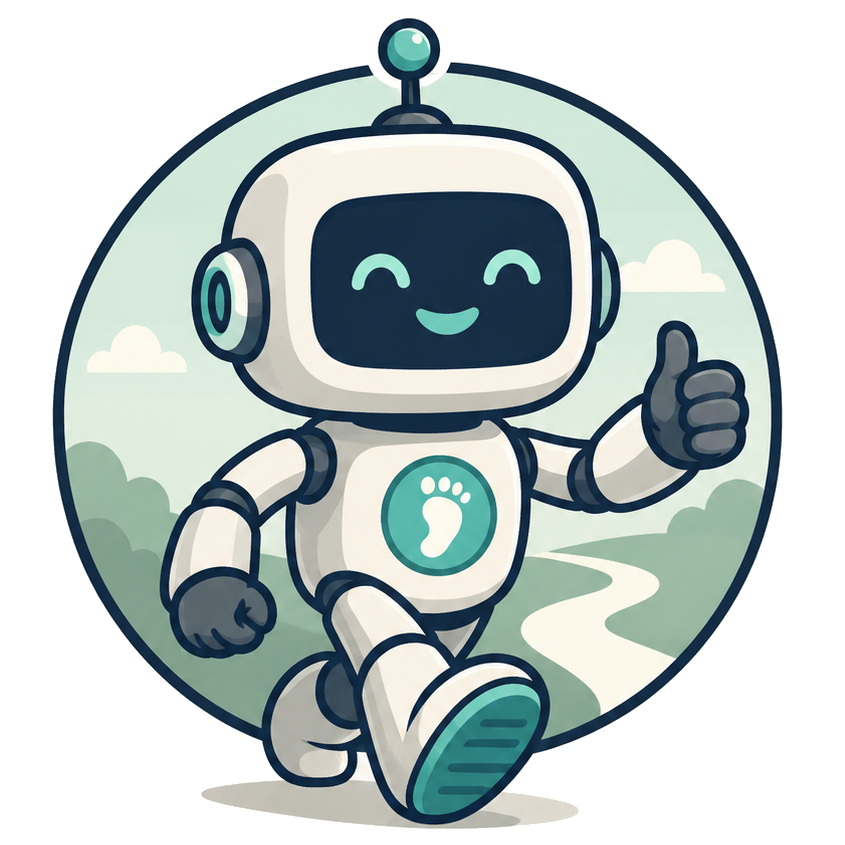
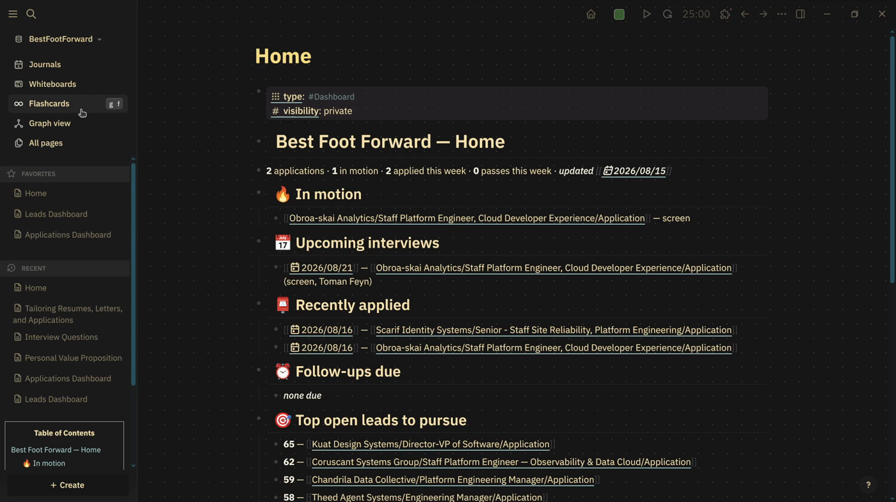

# Best Foot Forward



**Capture once. Use everywhere.**

[](https://github.com/Burney-Web-Services/Best-Foot-Forward/actions/workflows/tests.yml)
[](LICENSE)
[](https://www.python.org/downloads/)

https://github.com/user-attachments/assets/6bf9a85e-745e-45a7-bde5-8887c2127fe9

*65 seconds — onboarding through a tailored resume, scored against a real job description. Everything shown runs on the bundled [Leia Organa sample data](examples/leia-organa/README.md), so you can reproduce it after cloning.*

## Your career deserves a knowledge base.

A resume is lossy compression.

Years of experience become two pages. Projects become bullet points. Stories become keywords. Relationships disappear. Context disappears. The result works well enough for hiring systems, but it isn't your career.

Best Foot Forward preserves the projects, stories, accomplishments, decisions, and experiences that make up your professional life. Instead of rewriting your career for every application, you build a professional memory that AI can help you explore.

> A resume is a snapshot. A professional memory grows with you.

---

## Why this instead of the usual AI resume tools

Most AI resume tools are subscription services that rewrite your resume for you, one application at a time. Nothing you tell them persists. Every session starts from zero.

Best Foot Forward keeps what you tell it. It keeps your actual career, in your own words, and reframes what's already there to match each role. Nothing fabricated, nothing generic, no BFF subscription.

The professional memory is the point. The tailored resume is one thing you can pull from it.

Think of it as Obsidian or Logseq for your career, with job-search workflows built around it. That comparison is closer than it sounds: your pipeline really is a Logseq graph, and the files really are yours.

**Not the right fit if** you want a hosted service with a login, you want AI to invent experience you don't have, you'd rather not work in a terminal with a coding agent, or you need one resume, once, today. The payoff here comes from the memory accumulating.

---

## What goes into a professional memory

- Projects and what they were actually for
- STAR stories from real situations, captured in a structured interview
- Achievement bullets, tagged and traceable back to the story they came from
- Skill groups, employer context, education
- Job descriptions you evaluated, with the reasons you pursued or passed on each
- Every application, stage, contact, prep doc, and offer

---

## What it does

Everything below reads from and writes back to the same memory. Evaluating a job, tailoring a resume, and prepping for an interview all draw on one source of truth about your career.

- **Evaluates job fit.** Scores a job description 0–100 across five dimensions (technical match, role/level, domain, experience depth, gap risk) so you can triage before investing time.
- **Tailors your resume.** Asks a few targeted questions about gaps specific to this role, then builds a tailored version from your bullet and skills library.
- **Generates clean `.docx` files.** ATS-friendly resume and cover letter, ready to submit.
- **Tracks applications.** A SQLite database of every application, stage, contact, and offer.
- **Preps you for interviews.** Role-specific screening prep, interview prep, STAR flash cards, and a mock-interview drill with scored feedback.
- **Captures your stories.** A structured STAR interview that keeps the detail behind a resume line from getting lost.
- **Tracks skill gaps.** Compares the skills demanded across every role you evaluated against your own library, so you know where to focus.
- **Records why you passed.** A declined lead is kept, categorized, and reported on, not deleted.



*Your pipeline as linked Markdown you can read, edit, and keep. Shown with the bundled sample data.*

---

## The workflow

1. **Set up once.** Run `/onboard`. Bring a current resume, an outdated one, or nothing at all. You end up with a populated bullet and skills library plus a base resume.
2. **Evaluate.** Paste a job description or a URL. You get a scored fit analysis and a recommendation.
3. **Tailor.** Answer a few targeted questions, review the draft, iterate.
4. **Generate.** The `.docx` resume and cover letter are written to the role's folder.
5. **Prep.** When an interview lands, run `/interview-prep [Company]`.

The agent is conversational. If you want a different report, another format, or something tracked that isn't tracked yet, ask for it.

Full command reference: [docs/commands.md](docs/commands.md).

---

## Prerequisites

- One supported coding agent:
  - [Claude Code](https://claude.ai/code) with a paid Claude plan, or
  - [Codex](https://chatgpt.com/codex) with a supported ChatGPT or API login
- Python 3.11 or newer
- [uv](https://astral.sh/uv) for dependency management

---

## Quick setup

```bash
git clone https://github.com/Burney-Web-Services/Best-Foot-Forward.git
cd Best-Foot-Forward

# Install uv if you don't have it:
# curl -LsSf https://astral.sh/uv/install.sh | sh

uv sync                    # installs core dependencies
```

Open the project in your coding agent and run the onboarding workflow. In Claude Code, run `/onboard`. In Codex, invoke `$onboard` or just ask to onboard. It walks you through your career history, initializes the database, and generates your base resume.

Not ready to hand over your own history? `/onboard` offers a sample profile first. It loads the bundled [Leia Organa example dataset](examples/leia-organa/README.md), a fictional persona whose data came from real recorded runs of these same workflows, so you can try `/evaluate-job` and `/resume-tailor` against something real-shaped before committing your own.

Optional dependency groups:

```bash
uv sync --group audio      # interview recording + transcription
uv sync --group http       # MCP server over HTTP (multi-machine only)
uv sync --group dev        # pytest
```

### Codex and other agents

Workflows live in `.agents/skills/` and are discovered automatically by Codex, Gemini, and Antigravity. Shared instructions are in [AGENTS.md](AGENTS.md); the project-local MCP server is declared in `.codex/config.toml` and `.agents/mcp_config.json`. Trust the repository when your agent asks, then use `/mcp` to confirm the `bff` server and `/hooks` to review the application-tracking hook, which records an application after `generate_resume.py` writes a resume.

Claude Code has no hook block in `.claude/settings.json`, so under Claude Code that step is a manual `python3 src/best_foot_forward/utils/track_application.py` after generating documents. See [docs/machine-setup.md](docs/machine-setup.md).

---

## Your data stays yours

Capturing everything about your career only makes sense if it stays yours. There is no hosted service and no Best Foot Forward account. Your career data is stored on your own machine: everything in `data/` is gitignored — resume, bullets, skills, applications, generated files — and so is `memory/`.

Being precise about the one exception, because it matters: Best Foot Forward runs inside a coding agent. When you use it, whatever that session needs — the bullets being considered, the job description being scored — is sent to the model provider you chose, under that provider's terms. BFF adds no destination of its own, and nothing is retained anywhere but your disk.

Your job-search pipeline is also mirrored to a local **Logseq graph** at `data/BestFootForward/`, so you can browse companies, applications, prep, and notes as linked Markdown pages, or query them with AI. SQLite stays master for the reusable bullet and skills library. See [ADR-0008](docs/adr/0008-logseq-graph-pipeline-master.md).

---

## Optional features

Everything above works with Python and `uv` alone. Two things go further and are not required.

- **`/web`** launches a local, read-only web UI for browsing your database and Logseq graph. It pulls in a disposable Node.js clone the first time you run it. Skip it if you're happy in your agent and Logseq.
- **Multi-machine sync** (`/secondary`, `/push-leads`) lets a second machine, yours or a collaborator's, source and score leads that flow back to your primary database over MCP. Only relevant if you run BFF on more than one machine or have a second person helping triage leads. Most single-user setups never touch it. See [docs/README.md](docs/README.md#secondary-mode--sourcing-leads-with-a-collaborator).

---

## Learn more

[docs/README.md](docs/README.md) is the index: command reference, architecture diagrams, the full data reference, decision records, and the roadmap.

---

## Contributing

We're looking for developers, designers, career coaches, recruiters, and curious early users. See [CONTRIBUTORS.md](CONTRIBUTORS.md) for what we need and [CONTRIBUTING.md](CONTRIBUTING.md) for how to set up and send a change.

You don't need to write code to be useful here. There's an issue template for [field feedback](../../issues/new?template=field_feedback.yml) — if you coach job seekers or hire them, the scoring model has never been validated against real outcomes and we'd like to hear where it's wrong.

Participation is governed by our [Code of Conduct](CODE_OF_CONDUCT.md). Found a vulnerability? [SECURITY.md](SECURITY.md) — report it privately, not in a public issue.

## License

MIT. See [LICENSE](LICENSE).

---

We're not building another resume builder. We're building a better way to remember a career.

Every life contains knowledge worth keeping.
