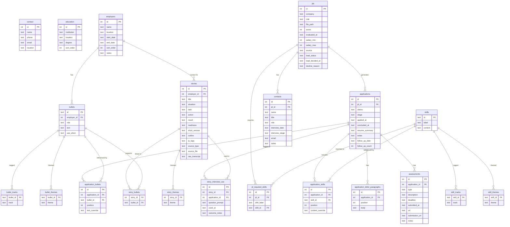
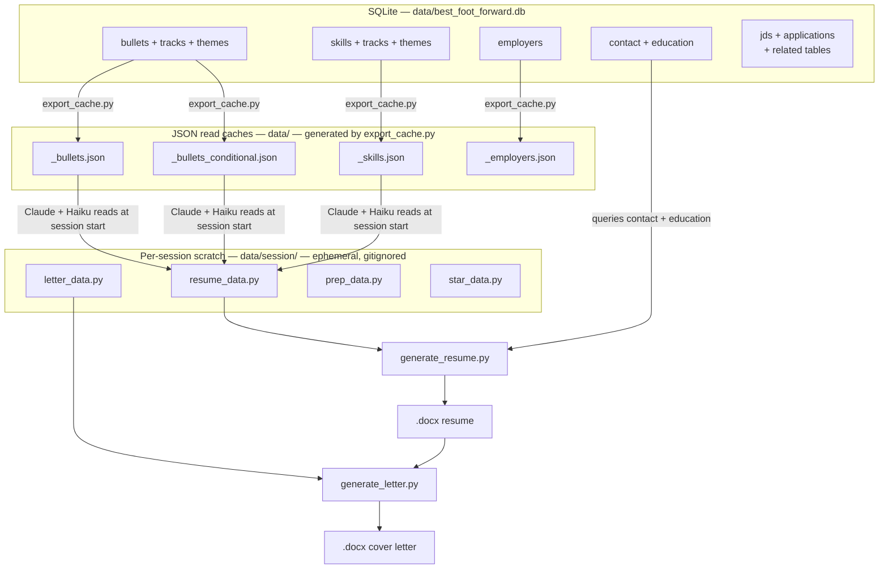
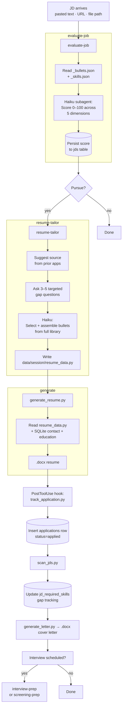
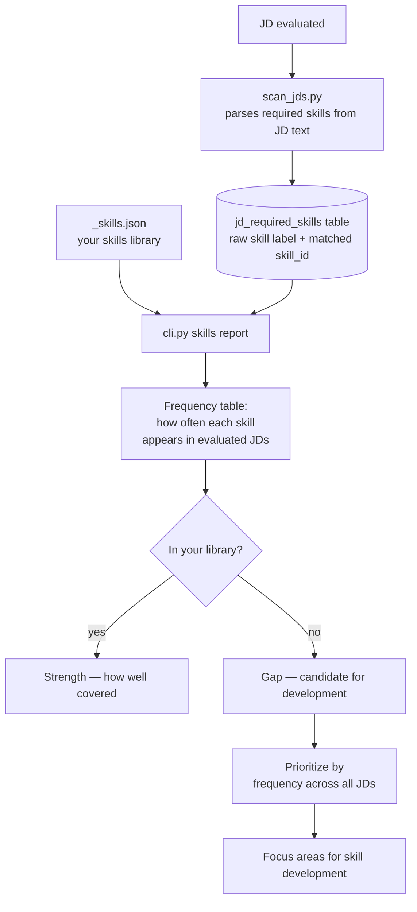
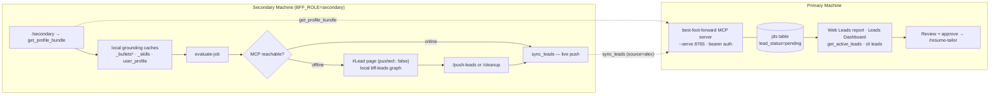

# Best Foot Forward — Architecture Reference

Diagrams use [Mermaid](https://mermaid.js.org/) syntax. Render in GitHub, VS Code (Mermaid Preview extension), or at [mermaid.live](https://mermaid.live).

---

## Database Schema

All persistent data lives in `data/best_foot_forward.db`. JSON files in `data/` are generated caches — edit via SQLite, then run `export_cache.py`.

---

## Data Layer

SQLite is the only source of truth. Everything else is generated.

---

## Logseq Graph (pipeline master)

The company / application / prep / notes layer is mirrored to a **Logseq Markdown
graph** at `data/BestFootForward/` (registered as the `bff` graph in
`markdown-graph-mcp`). See [ADR-0008](adr/0008-logseq-graph-pipeline-master.md).

- **Layout:** one entity page per company (`{Company}`, `mistoria-reference:: org:`),
  with namespaced children `{Company}/{Role}/Application|Prep|Notes` and a
  company-level `{Company}/Notes`. Each Application page carries the pipeline
  fields as `key:: value` properties (`status`, `stage`, `score`, dates as
  `[[YYYY/MM/DD]]`, `bff-jd-id::`/`bff-application-id::`) and a `## Related`
  section linking its siblings. Generated artifacts live in the graph's `assets/`.
- **Masters:** Markdown is master for the pipeline narrative; SQLite stays master
  for the library (bullets/skills/stories/employers → `.docx` + reporting) and is
  a rebuildable index over the pipeline.
- **Sync loop:**
  - `export_graph.py` — DB → pages (`--only '<Company>'` for one company; run as
    the last step of tailoring and on rejection).
  - `reconcile_graph.py` — hand-edited page properties → DB (column-UPSERT keyed
    on `bff-jd-id`/`bff-application-id`). Run before DB-backed reports.
  - `generate_home.py` — regenerates the `Home` + `Leads Dashboard` pages (and,
    if `BFF_SEVO_GLANCE` is set, a cross-graph pulse into a personal hub page).
- **Rule:** never `rm data/BestFootForward/pages/*.md` before an export —
  `export_graph` overwrites only the pages it generates (by title); a wipe deletes
  hand-authored Notes and ported reference pages.

## Tailoring Pipeline

The core workflow from JD intake through document generation.

---

## Gap Tracking

How the system identifies skill gaps between your profile and the roles you pursue.

---

## Secondary Machine Sync

Used when a sourcing collaborator (a collaborator today; a second machine of your own eventually) evaluates job leads on a separate
machine. Runs over the `best-foot-forward` MCP server — the reasoning stays in the collaborator's own
Claude session; only the grounding data (in) and the lead write-back (out) travel over MCP. A local
grounding cache + a local `bff-leads` graph make the whole flow offline-tolerant.

### How it works

1. **Grounding (in).** `/secondary` calls `get_profile_bundle` and writes the primary's per-track
   bullet caches, skills, employers, and `user_profile.md` locally. Scoring is calibrated to the
   primary's live inventory and survives a mid-session disconnect. `get_bullets` / `get_skills` /
   `get_career_profile` remain available for live reads.
2. **Evaluate.** `evaluate-job` scores against the local caches (identical online or offline).
3. **Lead write-back (out).** Online, each lead pushes immediately via `sync_leads`; offline, it
   queues as a `#Lead` page in the local `bff-leads` graph and `/push-leads` drains the queue when
   the connection returns. Dedupe is `(company, role)` — new leads insert, re-scored ones update.
4. **Provenance.** `_handle(msg, source=…)` threads the *authenticated* bearer-token identity into
   `_sync_leads` → `insert_leads(leads, source=…)`, so a lead lands as `source='alex'` (not a generic
   `'secondary'` or client-supplied field). This is what makes multi-secondary provenance trustworthy.
5. **Transport + exposure.** Streamable HTTP at `POST /mcp` (bearer auth; the server refuses to bind
   without a token registry). Bind stays `0.0.0.0` but the port is reached only over the LAN / Tailscale
   overlay with ACLs — tokens are a second layer, not a substitute for keeping it off the public net.
   Token registry: gitignored `data/mcp_tokens.json`, minted via `scripts/mint_token.py --name <who>`.

> The pre-MCP flow hand-carried a `bff-profile.json` bundle out and a `bff-leads.json` bundle back via
> four slash commands (`export-to-secondary` / `import-from-primary` / `export-to-primary` /
> `import-from-secondary`). Those commands and their scripts were removed once the MCP path + local
> `bff-leads` graph fully covered both the online and offline cases.

### Planned — public lead intake (Lovable form, non-Claude sourcers)

Status: not started. Target: weekend of 2026-07-18/19.

For sourcers who don't run Claude Code at all — no login, paste a link, done.
Deliberately pull-based so BFF's DB and MCP server stay unexposed to the public internet; the only
public-facing surface is Supabase, which is Lovable's job to secure, not ours.

- **Data model** (Supabase, Lovable's default backend) — table `leads_intake`: `id`, `source_name`,
  `url`, `pasted_text`, `note`, `status` (default `'new'`), `created_at`. No auth system — each
  sourcer gets a per-person magic link (`/intake/<sourcer>`) that pre-fills `source_name` via route
  param.
- **Bridge into BFF** — a small `utils/import_intake.py`, run on demand, pulls new rows from
  Supabase's auto-generated REST API and inserts stub `jds` rows (`source=<source_name>`,
  `lead_status='pending'`, `url=<url>`). Reuses `insert_leads()` (the same insert/UPSERT the
  `sync_leads` MCP tool uses), just sourced from a Supabase table instead of the MCP call.
- Secondary goal: the form itself is a small enough build to double as hands-on experience with
  whatever no-code/low-code platform you pick — worth something on its own if you're interviewing
  in that space.
